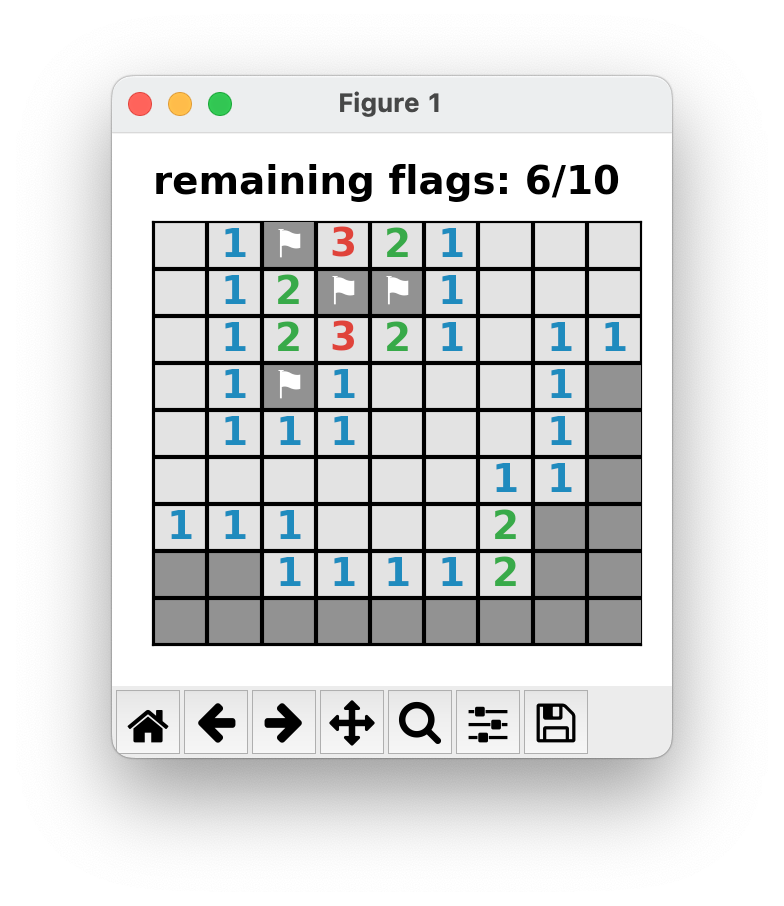
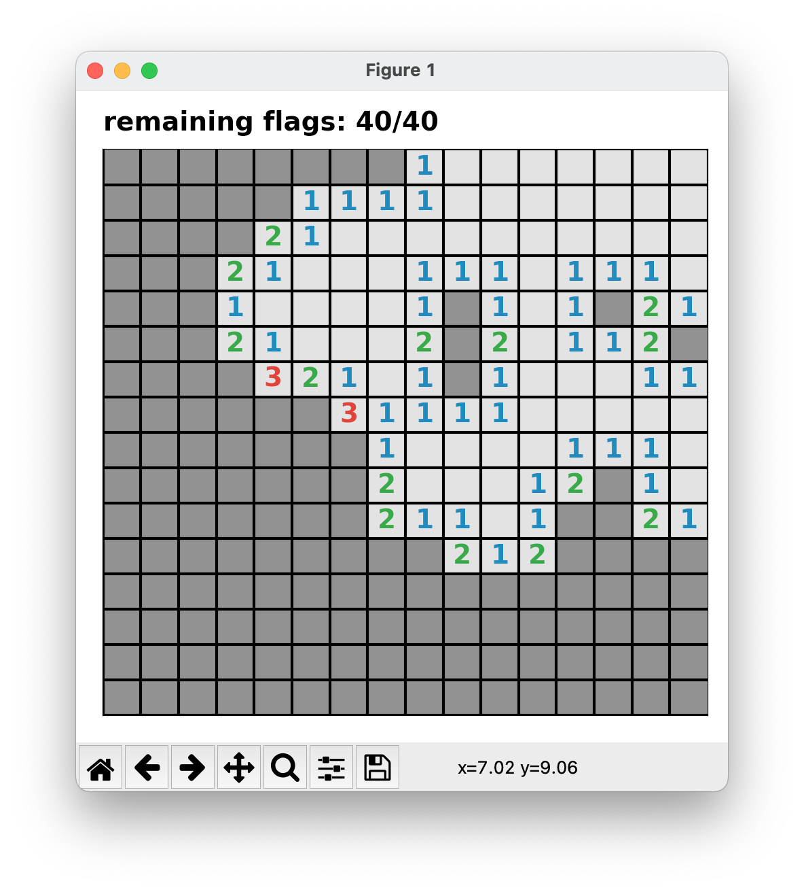
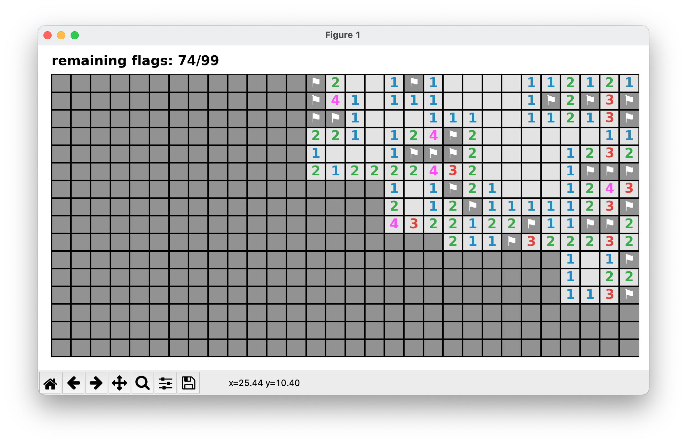
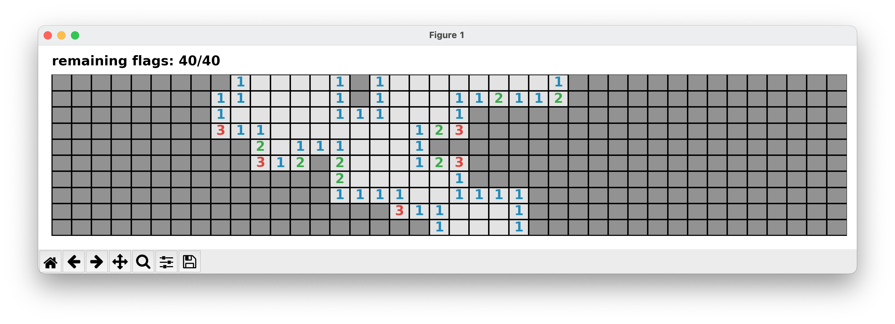

# Matplotlib-Minesweeper
A simple minesweeper implementation in the python matplotlib library.

## Features and gameplay
- left click: reveal tile
- right click: flag a tile
- at least 9 blank tiles at the first pick
- click on a number: reveal all surrounding tiles if number of flags equals the number of surrounding bombs

## Prerequisites
- python >= 3.10
- and following packages:
    - `matplotlib`
    - `numpy`
    - `random`

## Gallery 

#### Beginner game:
```python
from minesweeper import MW_Grid
MW_Grid.beginner()
```


#### Intermediate game:
```python
from minesweeper import MW_Grid
MW_Grid.intermediate()
```


#### Hard game:
```python
from minesweeper import MW_Grid
MW_Grid.hard()
```


#### Custom game:
```python
from minesweeper import MW_Grid
MW_Grid(size=(40, 10), num_of_bombs=40)
```


## Some inspiration
- [something similar](https://jakevdp.github.io/blog/2012/12/06/minesweeper-in-matplotlib/)
- [matplotlib event handling](https://matplotlib.org/stable/users/explain/event_handling.html)